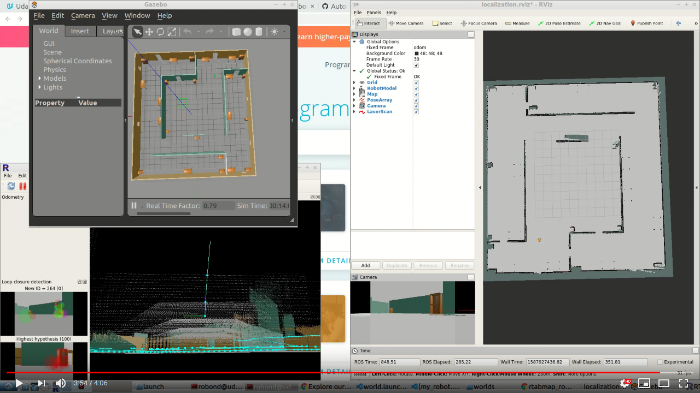

# Getting Started
To view this project, you must have Gazebo and ROS installed on Linux.

With Gazebo and ROS installed follow the steps -
```
curl -s https://packagecloud.io/install/repositories/github/git-lfs/script.deb.sh | sudo bash
sudo apt-get install git-lfs
git lfs install
git clone git@github.com:gpokhark/RoboND-Map_My_World-catkin_ws.git
cd RoboND-Map_My_World-catkin_ws/src
catkin_init_workspace
cd ..
rosdep -i install my_robot
rosdep -i install teleop_twist_keyboard
catkin_make
source devel/setup.bash
roslaunch my_robot world.launch
```

Control the robot using Teleop Package:
```
source devel/setup.bash
rosrun teleop_twist_keyboard teleop_twist_keyboard.py
```

Start mapping package:
```
source devel/setup.bash
roslaunch my_robot mapping.launch
```

# Project Overview - Map My World?
In this project I have used RTAB-Map ROS package to accurately map the world in the Gazebo simulation environment.

You can have a look at the output simulation video of my project.

[](https://www.youtube.com/watch?v=DVpaQI8ncpA)
[Video](https://www.youtube.com/watch?v=DVpaQI8ncpA)

# Database Analysis 
I have included my `rtabmap.db` file in the location [rtabmap.db](./src/my_robot/ros/rtabmap.db)

`./src/my_robot/ros/rtabmap.db`

This is a large file stored using git lfs. You will have to [install git-lfs](https://github.com/git-lfs/git-lfs/wiki/Installation) to download this file while cloning.
```
curl -s https://packagecloud.io/install/repositories/github/git-lfs/script.deb.sh | sudo bash
sudo apt-get install git-lfs
git lfs install
```
To start the mapping databse use the following commands:
```
source devel/setup.bash
rtabmap-databaseViewer src/my_robot/ros/rtabmap.db
```