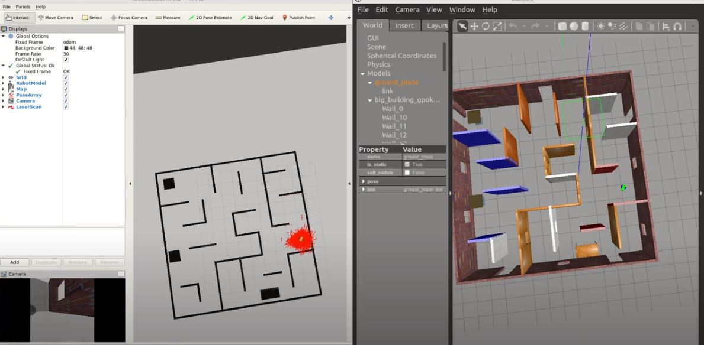

# Getting Started
To view this project, you must have Gazebo and ROS installed on Linux.

With Gazebo and ROS installed follow the steps -
```
git clone git@github.com:gpokhark/RoboND-Where_AM_I-catkin_ws.git
cd RoboND-Where_AM_I-catkin_ws/src
catkin_init_workspace
cd ..
rosdep -i install my_robot
rosdep -i install navigation
rosdep -i install teleop_twist_keyboard
catkin_make
source devel/setup.bash
roslaunch my_robot localization.launch
```

Control the robot using Teleop Package:
```
source devel/setup.bash
rosrun teleop_twist_keyboard teleop_twist_keyboard.py
```

# Project Overview - RoboND Where Am I?
In this project I have used ROS AMCL package to accurately localize a mobile robot inside a map in the Gazebo simulation environment.

You can have a look at the output simulation video of my project.

[](https://www.youtube.com/watch?v=kOdT1CU9gHY)
[Video](https://www.youtube.com/watch?v=kOdT1CU9gHY)

I have combined the `world.launch` and `amcl.launch` file into one single `localization.launch` file for ease of use.